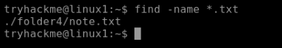
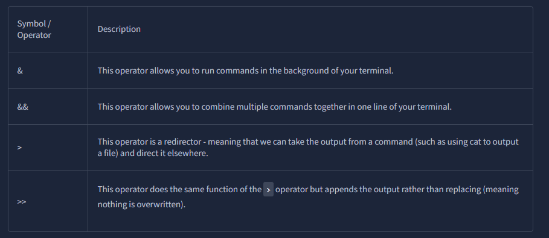
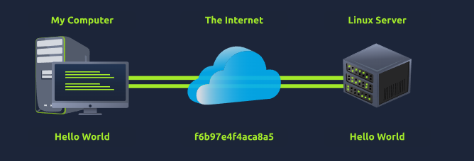
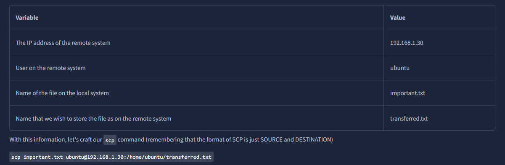
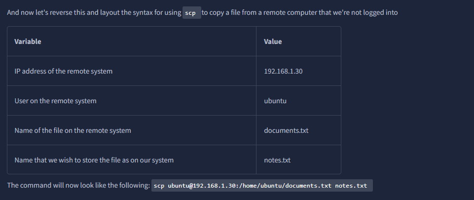
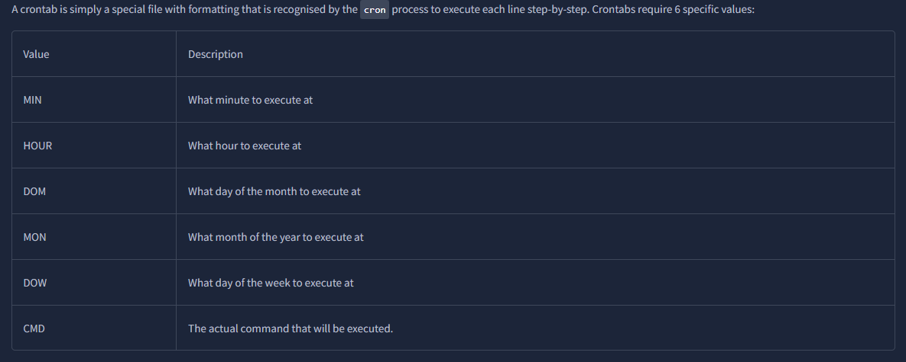
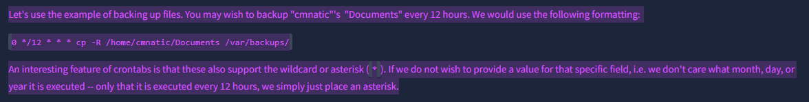
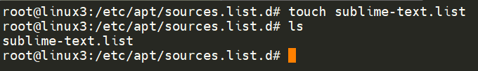

Echo command
1. If we echo single word we write
```bash
echo Hello
   ```
   2. But if we echo multiple words we spaces better use within  - ""
   ```bash
   echo "Hello World!"
   ```

## Find

1. Instead of cd and ls all folder to find a file we can use name of the file to find it.

2. Now we don't know file name but we know the extension :

we use '*' as wild character to find anything ending with extension '.txt'

## Grep
Helps search content of files or specific value that we are looking for.


## Shell Operators




# Linux Module 2

SSH
Secure Shell is a protocol between devices in encrypted form.
Using cryptography , any input we send in a human readable format is encrypted for travelling over a network where it is then unencrypted once it reaches the remote machine



--help
it is a formatted output of the man page

Man command
man command_to_know
eg: man ls


**rm command**
To remove a file you use rm followed by file name but to remove a directory you use **-R** flag

file -> command to determine the file type
File command takes one argument


## Common Directories

/tmp -> It is volatile
Used to store data that is only accessed once or twice(Similar to RAM )
Once the computer is restarted the memory of this folder is cleared out

IMP :What's useful for us in pentesting is that any user can write to this folder by default. Meaning once we have access to a machine, it serves as a good place to store things like our enumeration scripts.

/etc -> commonplace to store system files that are used by OS
eg : sudoers file -> contains list of users & groups that have permission to run sudo command as root
	passwd and shadown files are special Linux files as they show how system stores password for each user in encrypted format ->sha512
/var ->main root folder .
Stores data that is frequently accessed or written by services or application.
eg : log files from running services or application 

## SCP (SSH)
Transferring files from host to remote using scp (secure copy).
Working on a model of SOURCE and DESTINATION, SCP allows you to:
- Copy files & directories from your current system to a remote system
- Copy files & directories from a remote system to your current system



# Using HTTPServer  module Python 
"HTTPServer" will server the file in the directory  where you run the command (but you can change the path)
Command to start the server `python3 -m  http.server`
Note : One flaw with this module is that you have no way of indexing, so you must know the exact name and location of the file that you wish to use

So we prefer using updog a more advanced lightweight webserver.


### /etc/apt
This folder serves as the gateway/registry 
- Whilst Operating System vendors will maintain their own repositories, you can also add community repositories to your list!
- Additional repositories can be added by using the `add-apt-repository`command or by listing another provider.
	- For example, some vendors will have a repository that is closer to their geographical location.

### Process
A running program is called a process.
- They are managed by the kernel
- Each process has an ID called PID
- The PID increments in the order in which the process start i.e for the 60th process the PID is 60.

Viewing Process : using the **ps** command

It lists :
- PID
- Session that is running it
- how much usage time of the CPU it is using
- name of the actual program or command being executed

To see the process run by other users and that does not run from a session(system process) we provide aux to the ps command
- ps aux

top -> give realtime statistics about the processes running on your system instead of one-time view. These statistic will refresh after every 10 s but will also refresh when you press arrow keys to browse.


#### Managing processes
You can send signals to terminate processes.
To kill a process we use kill command followed by pid.
eg kill 1337

Below are some signals we can send to a process when it is killed:
- SIGTERM : Kill the process but allow it to do some cleanup before hand
- SIGKILL : Kill the process -doesn't do any clean up after the fact
- SIGSTOP : Stop/Suspend a process

# Process can run in two states
- foreground 
- background
Use Ctrl + Z to run a process in background. It is also a way to stop a script.

**Foregrounding processes**
We can use fg to bring back background process to terminal

How do Processes start?
Namespaces : OS uses namespaces to split up  the resources available on the computer to(such as CPU, Ram and priority) processes.
Think of splitting computer up into slices like cake.
Process within that slice will have certain amount of computing power, however , it will be a small portion of what is actually available to every process overall.

- Namespaces are great for security as it is a way of isolating processes from another -- only those that are in the same namespace will be able to see each other.
- The process with an ID of 0 is a process that is started when the system boots.
- This process is the system's init on Ubuntu, such as **systemd**,which is used to provide a way of managing a user's processes and sits in between the operating system and the user.
- For example, once a system boots and it initialises, **systemd** is one of the first processes that are started.
- Any program or piece of software that we want to start will start as what's known as a child process of **systemd**.
- This means that it is controlled by **systemd**, but will run as its own process (although sharing the resources from **systemd**) to make it easier for us to identify .

#  **Getting Processes/Services to Start on Boot**
-  `systemctl` -- this command allows us to interact with the **systemd** process/daemon
- systemctl is an easy to use command that takes the following formatting: `systemctl [option] [service]`
- For example, to tell apache to start up, we'll use `systemctl start apache2`. Same with if we wanted to stop apache, we'd just replace the `[option]` with stop .
- We can do four options with `systemctl`:
	- Start
	- Stop
	- Enable
	- Disable

# Automation
Cron process and how we interact with it via crontabs.

- Crontab is one of the processes that is started during boot, which is responsible for facilitating and managing cron jobs.



NOTE : Crontabs can be edited by using `crontab -e`

### adding and removing a repository manually
- When adding software, the integrity of what we download is guaranteed by the use of what is called GPG (Gnu Privacy Guard) keys.
- These keys are essentially a safety check from the developers saying, "here's our software". If the keys do not match up to what your system trusts and what the developers used, then the software will not be downloaded.
Adding Sublime Text as eg:
- So, to start, we need to add the GPG key for the developers of Sublime Text 3.
- **1.** Let's download the GPG key and use apt-key to trust it:  `wget -qO - https://download.sublimetext.com/sublimehq-pub.gpg | sudo apt-key add -`
- **2.** Now that we have added this key to our trusted list, we can now add Sublime Text 3's repository to our apt sources list. A good practice is to have a separate file for every different community/3rd party repository that we add.
- **2.1.** Let's create a file named **sublime-text.list** in **/etc/apt/sources.list.d** and enter the repository information like so:

**2.2.** And now use Nano or a text editor of your choice to add & save the Sublime Text 3 repository into this newly created file:

  

**2.3.** After we have added this entry, we need to update apt to recognise this new entry -- this is done using the `apt update` command

**2.4.** Once successfully updated, we can now proceed to install the software that we have trusted and added to apt using `apt install sublime-text`
- Removing packages is as easy as reversing. This process is done by using the `add-apt-repository --remove ppa:PPA_Name/ppa` command or by manually deleting the file that we previously added to. Once removed, we can just use `apt remove [software-name-here]` i.e. `apt remove sublime-text`


LOGGING
The Operating System  (OS) has become pretty good at automatically managing these logs in a process that is known as "rotating".
