Devices on networks are similar to human :
Human can be recognized via : 
1. Name
2. Fingerprint

We can change our name via deed poll but we can't change our fingerprints.
Similarly devices also have two means of identification:
1. MAC address 
2. IP address 

### **IP Address**
An IP address can be used to identify a host on a network for a period of time, where that IP address can be associated to another device without the IP address changing.
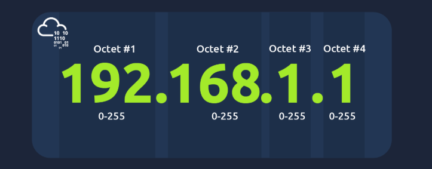

[NOTE]

IP Address can change from device to device but cannot be active simultaneously more than once within same network

IP address follow a set of standards called **protocol**

- A public IP address is used to identify a device on the internet while a private IP address is used to identify a device amongst other devices.
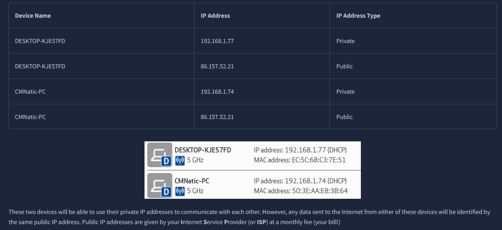
MAC Address
Devices on  a network will have a physical network interface ,a microchip board found on the device motherboard.
This network interface is assigned  a unique address at factory it is built called **MAC address.**

MAC ADDRESS: It is a 12 digit hexadecimal number split into two's seperated by colons.
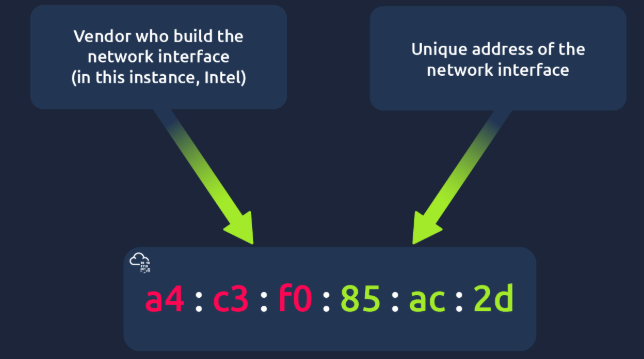

## Ping
Ping is a tool .
It uses ICMP (Internet Control Message Protocol) packets to determine the performance of a connection between two devices whether the connection exists or  is reliable.

1. The time taken by ICMP packets travelling between devices is measured by ping.
2. The measuring is done through ICMP echo packet and ICMP echo reply from target device

- pinging a device that has the private address of _192.168.1.254_
- Ping informs us that we have sent six ICMP packets, all of which were received with an average time of 4.16 milliseconds.

# LAN
Toplogy - design or look of the network at hand.

1. Star topology 
	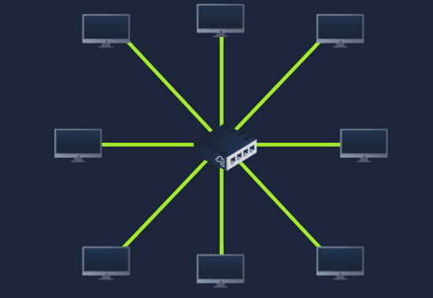
	- devices are individually connected via a central networking device such as a switch or hub.
	- Any information sent to a device in this topology is sent via the central device to which it connects.
2. Bus Toplogy
	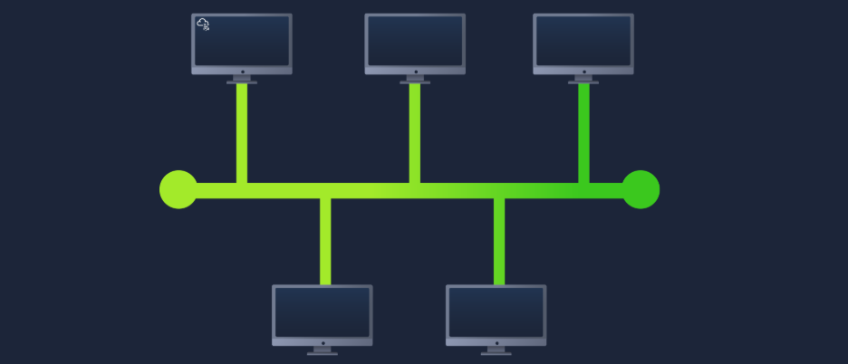
	- This type of connection relies upon a single connection which is known as a backbone cable.
3. Ring Topology(Token Topology)
	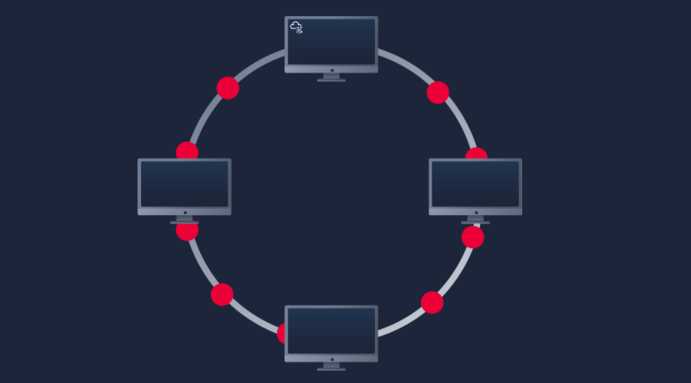
	- A ring topology works by sending data across the loop until it reaches the destined device, using other devices along the loop to forward the data.
	- Interestingly, a device will only send received data from another device in this topology if it does not have any to send itself.
	- If the device happens to have data to send, it will send its own data first before sending data from another device.

# Switch
Switches are dedicated devices within a network that are designed to aggregate multiple other devices such as computers, printers, or any other networking-capable device using ethernet.
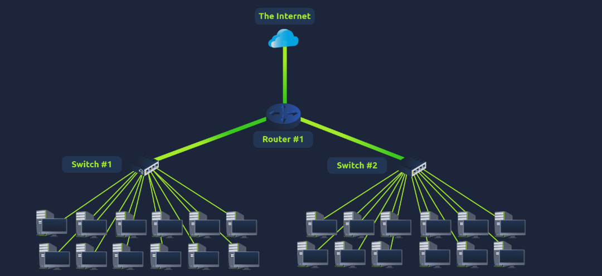
 Switches keep track of what device is connected to which port. 
 This way, when they receive a packet, instead of repeating that packet to every port like a hub would do, it just sends it to the intended target, thus reducing network traffic.

Router
It's a router's job to connect networks and pass data between them. It does them by routing.
Routing is the label given to the process of data travelling across networks.
Routing involves creating a path between networks so that this data can be successfully delivered.

Subnetting

- Breaking down network into smaller network is called subnetting.
- Think of it as slicing up a cake for your friends.
- There's only a certain amount of cake to go around, but everybody wants a piece.
- Subnetting is you deciding who gets what slice & reserving such a slice of this metaphorical cake.

How is subnetting achieved?
Subnetting is achieved by splitting up the number of hosts that can fit within the network, represented by a number called a subnet mask.

Subnets use IP addresses in three different ways:
- Identify the network address
- Identify the host address
- Identify the default gateway

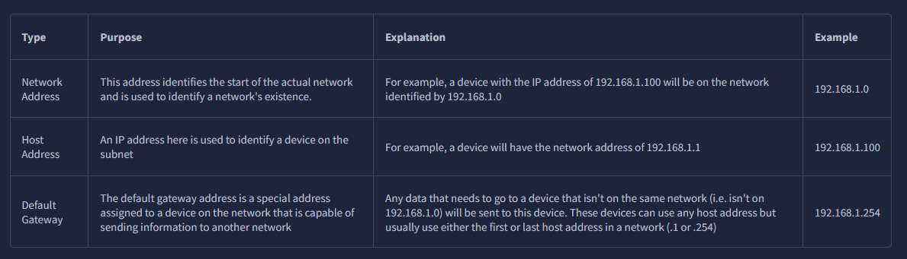

# ARP
 **ARP** for short, is the technology that is responsible for allowing devices to identify themselves on a network.
-  ARP allows a device to associate its MAC address with an IP address on the network.
- Each device on a network will keep a log of the MAC addresses associated with other devices
- When devices wish to communicate with another, they will send a broadcast to the entire network searching for the specific device.

How ARP works
- Each device within a network has a ledger to store information on, which is called a cache.
-  In the context of ARP, this cache stores the identifiers of other devices on the network.
- In order to map these two identifiers together (IP address and MAC address), ARP sends two types of messages:
		- **ARP Request**
		- **ARP Reply**
- When an **ARP request** is sent, a message is broadcasted on the network to other devices asking, "What is the mac address that owns this IP address?"
-  When the other devices receive that message, they will only respond if they own that IP address and will send an **ARP reply** with its MAC address.
- The requesting device can now remember this mapping and store it in its **ARP cache** for future use.
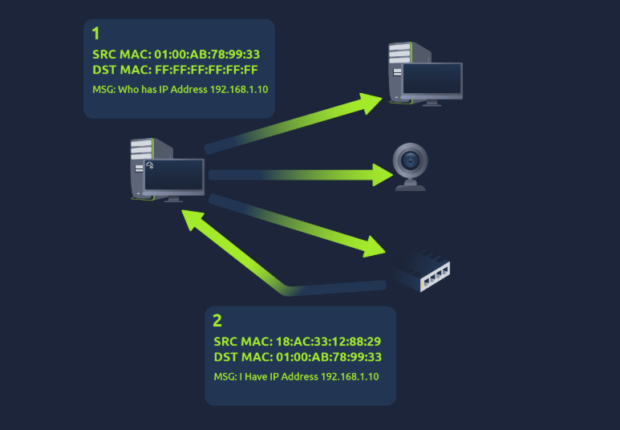

# Dynamic Host Configuration Protocol
- IP addresses can be assigned either manually, by entering them physically into a device, or automatically and most commonly by using a **DHCP** (**D**ynamic **H**ost **C**onfiguration **P**rotocol) server

How are IP addresses assgined?
- When a device connects to a network, if it has not already been manually assigned an IP address, it sends out a request (DHCP Discover) to see if any DHCP servers are on the network.
- The DHCP server then replies back with an IP address the device could use (DHCP Offer)
-  The device then sends a reply confirming it wants the offered IP Address (DHCP Request), and then lastly, the DHCP server sends a reply acknowledging this has been completed, and the device can start using the IP Address (DHCP ACK).
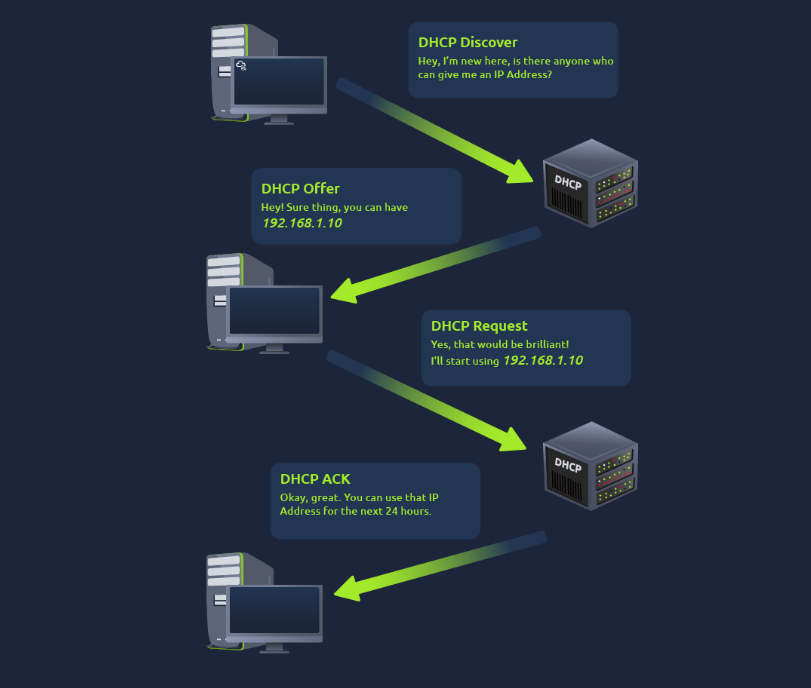

# OSI Model
Open Systems Interconnection Model -> provides a framework how network devices will send , receive and interpret data.

The key term for when pieces of information get added to data : encapsulation

Layer 1 
Physical Layer: components of hardware used in networking 
- Devices uses electrical signal to transfer data b/w each other in binaries(0s & 1s)
- eg : ethernet cable

Layer 2 (Data Link Layer)
The data link layer focuses on the physical addressing of the transmission
- It receives a packet from the network layer (including the IP address for the remote computer) and adds in the physical **MAC** (Media Access Control) address of the receiving endpoint.
-  When information is sent across a network, it’s actually the physical address that is used to identify where exactly to send the information.
Layer 3 : Network Layer
- Layer where routing and re-assembly of data takes place(from small chunks to larger chunks)
- Firstly routing determines the most optimal path in which these chunks should be sent
- While some protocols in this layer determine the exact optimal path.
- These protocols include OSPF(Open Shortest Path First ) and RIP (Routing Information Protocol)
- Factors that decided what path to take are :
	1. What path is shortest? .i.e has the least amount of devices that packet needs to travel across
	2. What path is most reliable? have packets been lost on that path before
	3. What path has faster physical connection ? one path using copper connection (slower)while the one using fiber (faster)

Layer 4: Transport Layer
This layer plays vital role in transmitting data across network .
When data is sent b/w devices it follows to two different protocols:
1.TCP
2.UDP
TCP incorporates error checking in into its design. . Error checking is how TCP can guarantee that data sent from the small chunks in the session layer (layer 5) has then been received and reassembled in the same order.

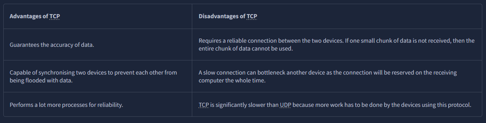
How data are sent in chunks in TCP 
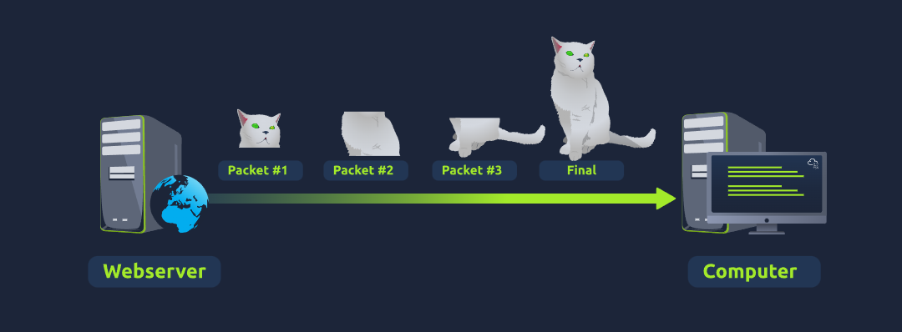
UDP : User DataGram Protocol
UDP is useful in situations where there are small pieces of data being sent.
For example, protocols used for discovering devices (_ARP_ and _DHCP_  or larger files such as video streaming (where it is okay if some part of the video is pixelated. Pixels are just lost pieces of data!)

# Session Layer 5
- Once data has been correctly translated or formatted from the presentation layer (layer 6), the session layer (layer 5) will begin to create and maintain the connection to other computer for which the data is destined.
-  When a connection is established, a session is created. Whilst this connection is active, so is the session.
- The session layer is also responsible for closing the connection if it hasn't been used in a while or if it is lost.
-  session _can_ contain "checkpoints," where if the data is lost, only the newest pieces of data are required to be sent, saving bandwidth.
# Presentation Layer 6
- Layer 6 of the OSI model is the layer in which standardisation starts to take place
- This layer acts as a translator for data to and from the application layer (layer 7).
- The receiving computer will also understand data sent to a computer in one format destined for in another format. For example, when you send an email, the other user may have another email client to you, but the contents of the email will still need to display the same.
- Security features such as data encryption (like HTTPS when visiting a secure site) occur at this layer.
