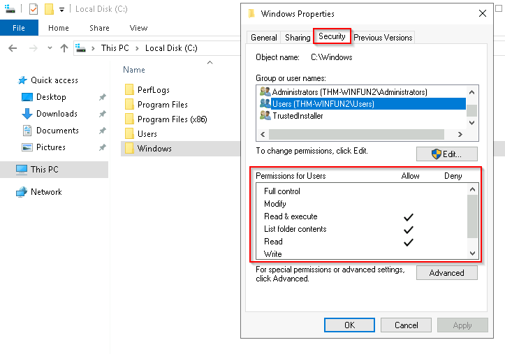

1985  year it started
-  the current version of the Windows operating system for servers is [Windows Server 2025](https://www.microsoft.com/en-us/windows-server/).
1. What encryption can you enable on Pro that you can't enable in Home?
	BitLocker Drive Encryption : If your device is lost or stolen, BitLocker puts everything on lockdown, so no one else can access your systems or data
Shortcut to open task manager
2. **Cltrl+Shift+Esc.**

# File System 
File system  used in modern version of Windows is NTFS (NEW Technology File System)
Before NTFS there were FAT16/FAT32(File Allocation Table) and HPFS (High Performance File System)

NTFS is known as journaling file system. In case of failure , filesystem can automaticaly repair the folders/file on disk using information stored in log file.
This is not possible in FAT32.

NTFS addresses many limitation of previous file system such as:
- Supports file larger than 4GB
- Set specific permission on folders and files
- Folder and file compression
- EFS ( Encryption File System)

ON NTFS volumes you can set permissions that grants or deny access  to files and folders:
The permissions are :
1. Full control
2. Modify
3. Read & Execute
4. List folder contents
5. Read 
6. Write

## How can you view the permissions for a file or folder?

1. - Right-click the file or folder you want to check for permissions.
2. - From the context menu, select `Properties` .
3. - Within Properties, click on the `Security` tab.
4. - In the `Group or user names` list, select the user, computer, or group whose permissions you want to view.
5. 

### Another great feature of NTFS is ADS (Alternate Data Streams)
ADS is a file attribute specific to NTFS
